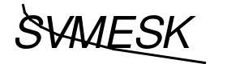
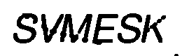
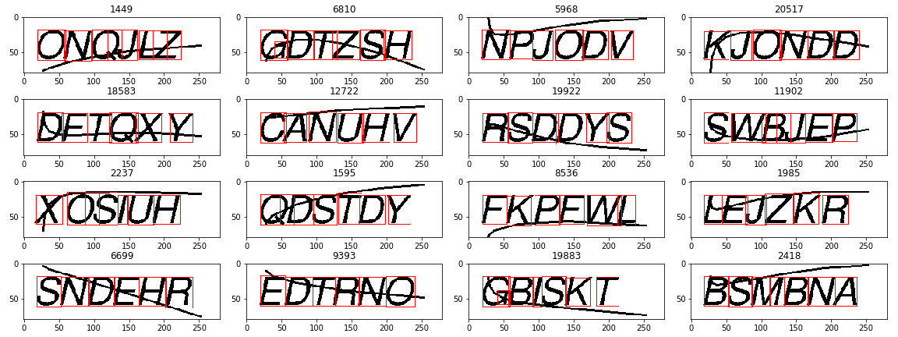

# Captcha-Solver

Original Image

Preprocessing Image

Answer : SVMESK

Preprocessing
---

Structure
---
* notebooks
  * KMeans
  * kfold_cnn
  * cnn
* make_answer.py
  * 수동으로 정답 데이터를 만드는 과정
  * tesseract ocr 을 이용하여 정답을 예측하며 사람이 판단하여 수정할 수 있는 GUI 환경
